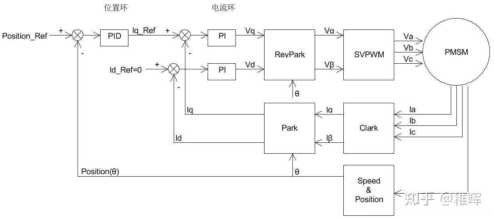

Foc算法原理参考：
https://zhuanlan.zhihu.com/p/147659820

其他参考：
项目
* https://gitee.com/wojialaomuzhu/foc-tutorial/tree/main/
* https://oshwhub.com/zdldcyy/ji-yu-Simple-FOC-ESP32de-shuang-?sharesource=qzone#P2
* https://oshwhub.com/panyunmeng/motor_foc_device
  
博客
* https://blog.csdn.net/Cegan/article/details/110920603
* https://blog.csdn.net/ABC13222880223/article/details/83758290

视频
* https://www.bilibili.com/video/BV1q4411d7RX?spm_id_from=333.999.0.0
* https://www.bilibili.com/video/BV1f54y1Y7Ls?spm_id_from=333.999.0.0
* https://www.bilibili.com/video/BV1bR4y1g7MT?spm_id_from=333.999.0.0

控制原理
因为编码器用平均测速法返回转速时在低速情况下有很大误差，所以抛弃了速度的闭环控制，只留下了电流环和位置环的闭环控制

如何调试
先调试SVPWM再调试电流采样，再闭环，SVPWM即可实现电机旋转。
闭环先调电流环再调速度环
环先调试ID再调试IQ

其他知识点：
一般单片机的ADC范围能达到0~3.3V，精度为3.3/4096V
通信方式SPI，CAN
IR2101，IR2102，IR2103芯片用于驱动，建议用IR2103
编码器的A相、B相、Z相信号中，A、B两个通道的信号一般是正交（即互差90°）脉冲信号；而Z相是零脉冲信号。一般编码器输出信号除A、B两相（A、B两通道的信号序列相位差为90度）外，每转一圈还输出一个零位脉冲Z
代码结构可以参考gitee上的刘祥的FOC教程

stm32f103c8t6管脚分配
通讯管脚
PA9   USART1_TX
PA10  USART1_RX

使能管脚
PB4   GPIO_Output
PB5   GPIO_Output

PWM管脚
IR2103的Deadtime是520ns，最大频率为1.9MHz,这里TIM4配置的是1MHz,PWM是1KHZ
PB6   TIM4_CH1
PB7   TIM4_CH2
PB8   TIM4_CH3
PB9   TIM4_CH4

ADC管脚
PA0
PA1
PA2

编码器接口管脚
PA6-A
PA7-B
PC15-Z(预留，因为可以不用Z完成测速等操作)

